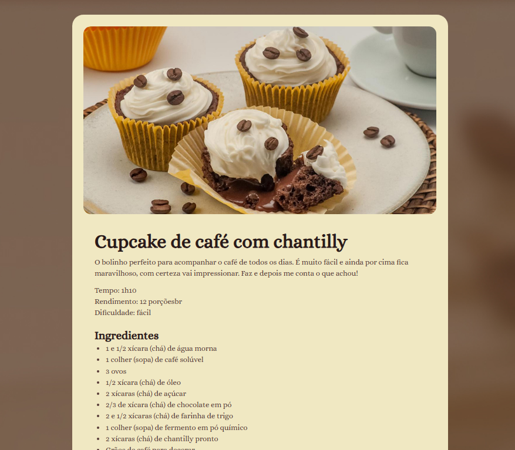

# 🍽️ Página de Receitas
 - Aula de um curso fullstack da [Rocketseat](https://www.rocketseat.com.br)

## Receita de um Cupcake
Nesse desafio proposto nas aulas de HTML e CSS foi proposto a criação de uma página de receitas de um Cupcake, um desáfio de nível iniciante mas que foi bem divertido. 

<p align="center">
  
</p>

### 🚀 Tecnologias Utilizadas
- HTML5  
- CSS  

### 💻 Como Executar
1. Clone o repositório  
   ```bash
   https://github.com/matheusntss/ProjetoReceita.git

